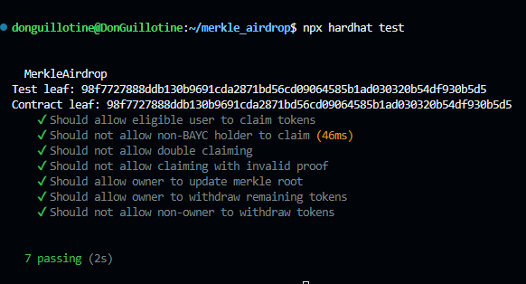

# Merkle Airdrop Smart Contract with BAYC Ownership Validation

This project implements a Merkle Airdrop smart contract using Hardhat, with the additional requirement that users must own a **BoredApeYachtClub (BAYC)** NFT to claim their airdrop. The airdrop distribution is based on a **Merkle Tree** generated from a list of eligible addresses and their respective airdrop amounts.

# All tests passed



## Features

1. **ERC20 Token Deployment**:  
   I created my own ERC20 token which is deployed on the Sepolia testnet for the purpose of this airdrop.

2. **Merkle Airdrop Contract**:  
   The contract accepts the ERC20 token address and Merkle root as constructor parameters. It ensures that only users who own a **BAYC NFT** (verified via the BAYC smart contract on Ethereum mainnet) can claim tokens, and each user can claim their airdrop only once.

3. **Merkle Tree Proof**:  
   The Merkle tree is generated from a CSV file of eligible addresses and airdrop amounts. The root of this Merkle tree is passed to the smart contract during deployment. Each user must provide a valid Merkle proof when claiming their tokens.

4. **Claim Tracking**:  
   The contract tracks which users have claimed their tokens to prevent multiple claims. This ensures fairness and prevents abuse.

## Project Structure

```bash
.
├── contracts
│   ├── ERC20.sol       # ERC20 token contract
│   ├── MerkleAirdrop.sol        # Merkle Airdrop contract with BAYC ownership validation
├── data
│   ├── merkle.js                # Script to generate Merkle root and proofs from CSV
│   ├── merged_bayc_and_mockaroo.csv # CSV file containig mock addresses and BAYC holders
├── scripts
│   ├── deploy_token.js           # Deployment script for DonGuilloToken
│   ├── deploy_airdrop.js         # Deployment script for MerkleAirdrop
├── test
│   ├── MerkleAirdrop.js    # Unit tests for the airdrop contract
└── README.md
```

## Requirements

- **Node.js**
- **Hardhat** for development and testing
- **ethers.js** for interacting with Ethereum
- **Merkle.js** for generating the Merkle tree
- **Sepolia Testnet** for deploying the ERC20 token and airdrop contract
- **Metamask** with Sepolia Testnet configured and test ETH for gas fees
- **BoredApeYachtClub NFT contract** address: `0xbc4ca0eda7647a8ab7c2061c2e118a18a936f13d`

## Setup

1. **Clone the repository**:
   ```bash
   git clone https://github.com/DonGuillotine/merkle-airdrop.git
   cd merkle-airdrop
   ```

2. **Install dependencies**:
   ```bash
   npm install
   ```

3. **Compile the contracts**:
   ```bash
   npx hardhat compile
   ```

4. **Generate the Merkle Tree**:
   - Run the `merkle.js` script to generate the Merkle root and proofs from the `merged_bayc_and_mockaroo.csv` file:
     ```bash
     node merkle.js
     ```

   - The output will include the Merkle root and the proofs for each address.

5. **Deploy the contracts**:
   - Deploy the ERC20 token and airdrop contracts to the Sepolia testnet using the deployment script:
     ```bash
     npx hardhat run scripts/deploy.js --network sepolia
     ```

6. **Testing**:
   - Run the unit tests for the Merkle Airdrop contract to ensure correct functionality:
     ```bash
     npx hardhat test
     ```

## Airdrop Claim Process

1. **Ownership Verification**:
   - Users must own a **BAYC NFT** on the Ethereum mainnet in order to claim their airdrop.

2. **Merkle Proof**:
   - Users must provide a valid **Merkle Proof** corresponding to their address in the Merkle tree. The Merkle proof can be generated using the `merkle.js` script.

3. **Claiming Tokens**:
   - Once the ownership and Merkle proof are verified, users can claim their allocated tokens using the `claim` function in the Merkle Airdrop contract.

## Testing Scenarios

The following test cases have been implemented in the unit tests:

- **Successful claims**:  
  Users who own a BAYC NFT and are included in the Merkle tree can claim their tokens successfully.

- **Failure cases**:  
  - Users who do not own a BAYC NFT cannot claim tokens.
  - Users attempting to claim more than once are blocked by the contract.

- **Edge cases**:  
  - Invalid Merkle proofs.
  - Users not present in the Merkle tree.

## Smart Contract Details

### DonGuilloToken.sol

- **Name**: DonGuilloToken (DGT)
- **Symbol**: DGT
- **Total Supply**: 1,000,000 DGT

## Tools and Technologies

- **Hardhat**: Ethereum development environment
- **Solidity**: Smart contract programming language
- **ethers.js**: Ethereum library for interacting with smart contracts
- **Merkle.js**: Library for generating Merkle trees and proofs
- **Sepolia Testnet**: Ethereum testnet for deployment
- **Chai**: Assertion library for unit testing

## Deployment

The smart contracts are deployed on the **Sepolia Testnet**. You can interact with the deployed contracts via a front-end or using Hardhat tasks.

- **ERC20 Token Address**: https://sepolia.etherscan.io/address/0x8B8e531d86f39B6D4F26A623793A030d8A79ed14#writeContract
- **Merkle Airdrop Contract Address**: https://sepolia.etherscan.io/address/0x924698555d528356DF5f6ECdAA39a0904a707b1a#writeContract

## Contributing

Feel free to open issues or pull requests if you encounter any bugs or want to add new features!
